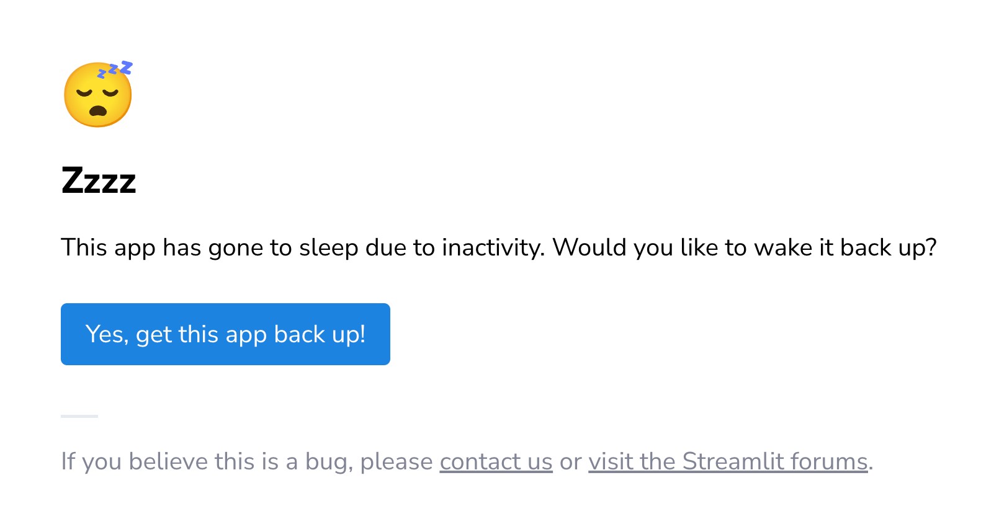

<div align="center">
  

  # 🏠 [**EstimAI**](https://estimai-british-columbia.streamlit.app/) — AI-Powered Property Price Estimator

  **Estimate any property's market value in British Columbia, Canada, powered by Machine Learning.**  
  👉 [**Try the Live App**](https://estimai-british-columbia.streamlit.app/)

</div>

---
## 🎯 About the Project

**EstimAI** is a Machine Learning web application that estimates residential property prices in **British Columbia, Canada**. Users enter an address and describe their property's characteristics. The app returns a price estimate with a confidence range.

### Motivation

I've built this project to combine two personal interests: **Artificial Intelligence** and **real estate**. My goal was to go beyond notebooks and academic exercises by building and deploying a complete ML product, from raw data cleaning, to a live, publicly accessible, web app. It was also an opportunity for me to learn **Streamlit** and get experience with **model deployment**.

### Who Is It For?

For anyone curious about property values in British Columbia or anyone exploring the BC real estate market.

---

## 📖 Summary

- [Live Demo](#-live-demo)
- [Features](#-features)
- [Machine Learning Pipeline](#-machine-learning-pipeline)
- [Dataset](#-dataset)
- [Technologies used](#-technologies-used)
- [Project Structure](#-project-structure)
- [Installation & Local Usage](#-installation--local-usage)
- [Disclaimer](#-disclaimer)

---

## 🌐 Live Demo

**👉 [https://estimai-british-columbia.streamlit.app/](https://estimai-british-columbia.streamlit.app/)**

The app is fully responsive and optimized for both **desktop** and **mobile** devices.  
Enter an address in British Columbia, fill in property details, and get an instant AI estimate.




```
User enters address & property details
                │
                ▼
Geoapify API geocodes the address
(only if its in Canada, British Columbia)
                │
                ▼
Features are assembled into a DataFrame
(one-hot encoding, missing indicators...)
                │
                ▼
GradientBoostingRegressor predicts log(price)
                │
                ▼
exp(prediction) in order to estimated price in $CAD
                │
                ▼
MAPE for the price range for the min/max estimates
                │
                ▼
Results displayed with low/high estimates
```


---

## ✨ Features

- **Address geocoding** : uses the Geoapify API to convert your address into coordinates. Only BC addresses are accepted.
- **Map display** : shows a pin on the map so you can confirm the location.
- **Property form** : property type, square footage, acreage, beds, baths, heating, parking, tax…
- **"I don't know" options** : if you don't know the acreage or the tax amount, you can skip it. The model handles missing values with indicator features.
- **Price prediction** : a Gradient Boosting model gives you an estimated price.
- **Min/Max range** : based on the model's error rate (MAPE) for your price segment, you get a low and high estimate.
- **Mobile friendly** : the UI adapts to smaller screens.

---

## 🧠 Machine Learning Pipeline

### Models Explored


| Model | Result |
|---|---|
| Ridge / Lasso / ElasticNet | Too simple, underfitting |
| KNN | Didn't generalize well |
| AdaBoost | OK but not as good as Gradient Boosting |
| Random Forest | Good but overfitted more |
| **Gradient Boosting + DecisionTree** | **Best trade-off between performance and overfitting** |

I used **BayesianSearchCV** (`scikit-optimize`) for hyperparameter tuning.

### Target Transformation

The target variable (`Price`) was **log-transformed** before training:

$$Y = \ln(1 + \text{Price})$$

Without this, the model tries to reduce errors on expensive properties (because the absolute errors are bigger). With the log, a 50k$ mistake on a 200k$ house counts more than the same mistake on a 5M$ house. This way the model is fairer across all price ranges.

### Final Model Performance

Here are the detailed metrics of the final model (Train set vs. Test set )

| Metric | Test Set | Train Set |
|--------|----------|-----------|
| R² | 0.842 | 0.923 |
| MAE | \$263,672 | \$184,590 |
| RMSE | \$692,304 | \$507,171 |
| MAPE | 14.3% | 10.1% |
| RMSLE | 0.208 | 0.144 |

The gap between train and test scores indicates a slight overfitting, which is acceptable given the dataset size and feature complexity.

### Mean Average Percentage Error (MAPE) by Price Range

The model's accuracy was evaluated across five price segments to ensure fair performance at all price levels:

| Price Range (CAD) | MAPE |
|---|---|
| \$64,900 – \$638,000 | 16.8% |
| \$638,000 – \$889,000 | 9.9% |
| \$889,000 – \$1,327,400 | 11.5% |
| \$1,327,400 – \$2,043,133 | 14.7% |
| \$2,043,133 – \$28,888,000 | 18.7% |

The model is most accurate for mid-range properties. I use these error rates to calculate the min/max price range shown in the app.

---

## 📄 Dataset

- **Source:** [Canada Housing Dataset on Kaggle](https://www.kaggle.com/datasets/yuliiabulana/canada-housing)
- **Region:** British Columbia, Canada.
- **Why this dataset?** It is one of the most complete publicly available real estate datasets, far more realistic than datasets like California Housing or French government open data.

### Data Engineering

The raw dataset had **~35,000 rows** and **100+ columns**, most of which were empty or useless.

After cleaning, I ended up with **22,157 rows and 38 columns**. Here's what I did:
- Removed rows with clearly wrong values (e.g. houses with 0 bedrooms listed at millions of dollars)
- Dropped columns that had too many missing values (>70%)
- Created binary columns to indicate when a value was missing (for acreage, tax, parking, heating)
- One-hot encoded categorical columns (property type, heating system, energy source)
- Applied `log(1 + Price)` on the target before splitting into train/test


---

## </> Technologies used

| Layer | Technology |
|---|---|
| **Language** | Python 3.10+ |
| **ML Framework** | Scikit-Learn (GradientBoostingRegressor, BayesianSearchCV) |
| **Web App** | Streamlit |
| **Geocoding API** | Geoapify |
| **Data Processing** | Pandas, NumPy |
| **Saving objects** | Joblib |
| **Deployment** | Streamlit Community Cloud |
| **Notebooks** | Jupyter |

---

## 🗂️ Project Structure 


```
canada-housing-predictor/
│
├── app/                              # Streamlit web application
│   ├── streamlit_app.py              # Main app source code
│   ├── estimlogo.png                 # EstimAI logo
│   └── sunny.jpg                     # banner image
│
├── artifacts/                        # Trained models & search results
│   ├── gdb_final_model.pkl           # Production model (GradientBoosting)
│   ├── gdb_mape_dict.pkl             # MAPE per price range (for confidence intervals)
│   ├── ada_best_model.pkl            # Best AdaBoost model
│   └──  rdf_best_model.pkl            # Best Random Forest model
│
├── data/                             # Data pipeline
│   ├── canada/                       # Raw source data (Hidden in Github)
│   ├── processed/                    # Cleaned & feature-engineered data (Hidden in Github)
│   ├── raw_data_cleaning.ipynb       # Data cleaning notebook
│   └── data_analysis.ipynb           # Exploration of the dataset
│
├── notebooks/                        # Model training & experimentation
│   ├── Linear_reg.ipynb              # Ridge, Lasso, ElasticNet
│   ├── Random_Forest.ipynb           # Random Forest experiments
│   ├── AdaBoostRegressor.ipynb       # AdaBoost experiments
│   ├── GradientBoostRegressor.ipynb  # Final model training
│   └── models_analysis.ipynb         # Cross-model comparison
│
├── requirements.txt                  # Python dependencies
└── README.md                         # This file
```

---

## 🚀 Installation & Local Usage

> **Note:** The app is already live at [estimai-british-columbia.streamlit.app](https://estimai-british-columbia.streamlit.app/). Local installation is only needed if you want to explore the code or retrain models.

### Prerequisites

- Python 3.10+
- A [Geoapify API key](https://www.geoapify.com/) (Available for free)

### Steps

1. Clone the repository
```bash
git clone https://github.com/Marwane-ELM/EstimAI-property-price-estimator.git
cd EstimAI-property-price-estimator
```
2. Create and activate a virtual environment
```bash
python -m venv venv
source venv/bin/activate        # Linux/Mac
venv\Scripts\activate         # Windows
```

3. Install dependencies
```bash
pip install -r requirements.txt
```

4. Set up your API key
```bash
#    Create a file: .streamlit/secrets.toml
mkdir -p .streamlit
echo 'GEOAPIFY_API_KEY = "your_api_key_here"' > .streamlit/secrets.toml
```

5. Run the app
```bash
streamlit run app/streamlit_app.py
```

Then the app will open in your browser.

---

## ⚠️ Disclaimer

> This tool provides **AI-generated estimates for informational purposes only**. It is **not** a professional appraisal. Actual property values may vary based on market conditions, property condition, and other factors not captured in the model. Always consult a licensed real estate professional for accurate property valuations.

---
<div align="center">
  
**Built with ❤️ by Marwane ELM 🍁**

</div>

